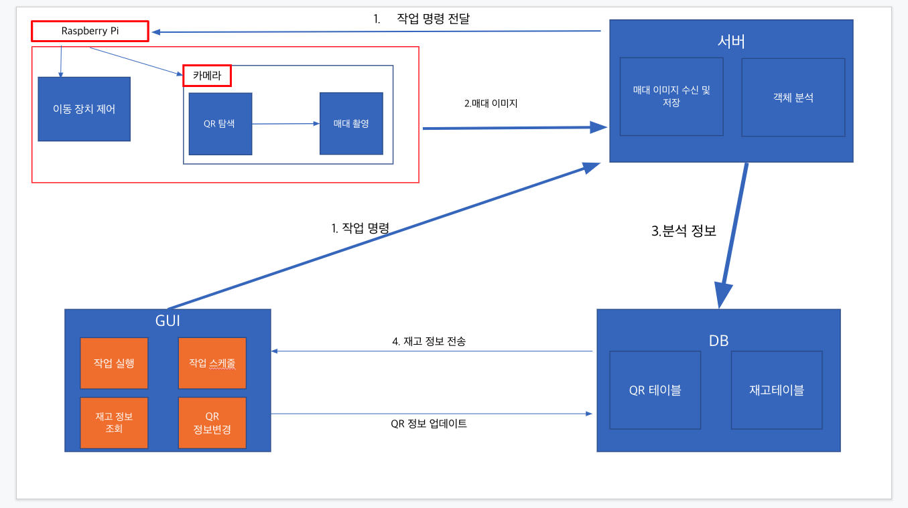

# Final Project
자동 재고파악 서비스

</img>

## Server
1. Client에게 Name+Command를 받아온다.
2. DB를 통해 Client_Name을 확인하여 해당 Raspberry를 찾아낸다.
3. Raspberry에게 Command를 보낸다.
4. Raspberry가 명령을 수행하고 수집된 정보를 받아온다.
5. 받아온 정보를 분석하고 DB에 저장한다.
6. 분석된 결과를 Client에게 보낸다.

## Client
0. ID와 PASS를 입력하여 로그인을 한다.(DB에서 실재 존재하는지 확인)
1. 원하는 명령을 GUI Btn을 통해 Server에게 보낸다.
2. 명령에 대한 결과값을 Server로부터 받아온다.

## Camera
0. ID와 PASS를 입력하여 로그인을 한다.(DB에서 실재 존재하는지 확인)
1. Server에게 받은 명령을 바탕으로 임무를 수행한다.
2. 수행한 명령에 대한 파일을 Server로 보낸다.

## DB
1. Inventory_Table (Item_Name, Amount, Time, ImagePath, Item_place)
```sql
create table Inventory_Table(
    Item_Name VARCHAR(30),
    Amount INT(100) NOT NULL,
    Time DATETIME NOT NULL,
    ImagePath VARCHAR(50) NULL,
    Item_place VARCHAR(50) NULL,
    PRIMARY KEY(Item_Name)
    ); 
```