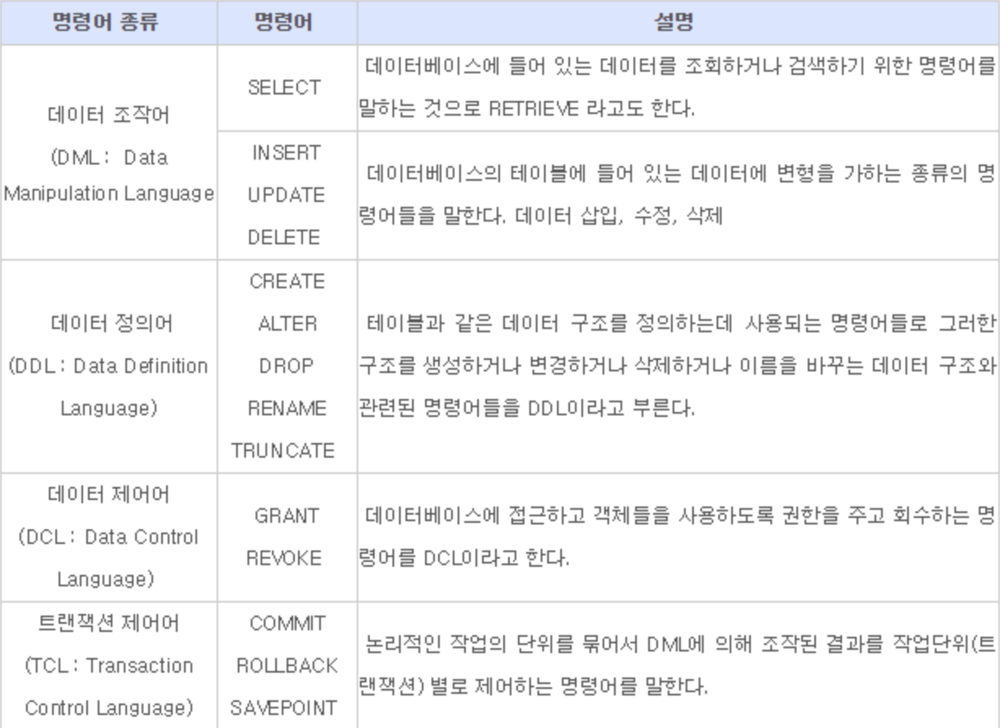
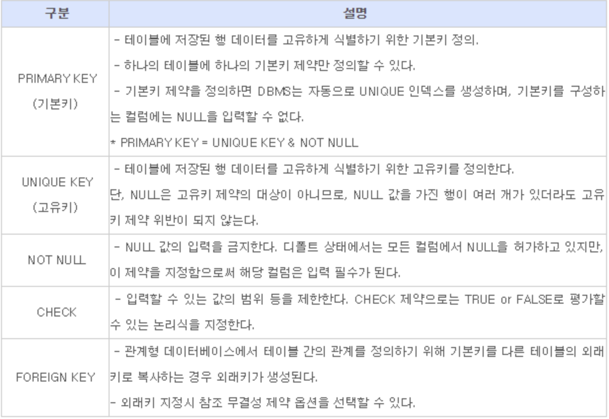
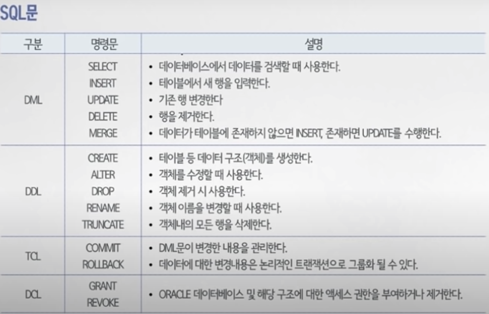

# DB

## DB [행(low)과 열(column)으로 구성된 2차원 데이터]
[관련 youtube](youtube.com/watch?v=vgIc4ctNFbc&t=2090s)

1. Not NULL
2. Primary key (ex. 사번)
3. Unique (ex. 전화번호)
4. Foreign Key (DB에 저장되어있는 Data)

</img>

[MariaDB](youtube.com/watch?v=vgIc4ctNFbc&t=2090s)

</img>
</img>

---

## Mysql
[참고 blog](https://m.blog.naver.com/jesang1/221993846056)

### 설치 및 설정

1. 설치 : sudo apt-get install mysql-server
2. 3306Port Open : sudo ufw allow mysql
3. 실행 : sudo systemctl start mysql
4. Ubuntu 서버 재시작시 Mysql 자동 재시작 : sudo systemctl enable mysql
5. Mysql 접속 : sudo /usr/bin/mysql -u root -p
6. Version 확인 : mysql> show variables like "%version%";
7. 비밀번호 변경 : SET PASSWORD FOR 'root'@'localhost' = PASSWORD('new password'); * 괄호와 '' 포함
8. 사용자 정보 확인 : SELECT User, Host, authentication_string FROM mysql.user;

### DB 다루기

1. 생성 : CREATE DATABASE (DataBaseName);
2. 확인 : SHOW DATABASES;
3. 새로운 사용자 생성 : CREATE USER 'newUser'@'localhost' IDENTIFIED BY 'mysql password';
4. 변경사항 새로고침 : FLUSH PRIVILEGES;
5. 권한 부여 : GRANT ALL PRIVILEGES ON 데이터베이스이름.* to'권할을 부여할 사용자'@'localhost';
6. DB 보기 : SHOW GRANTS FOR'UserName'@'localhost';
7. 새로운 사용자 로그인 : mysql -u userName -p
8. 생성한 DB 사용 : USE DBname;

### mysql.h 연동

1. mysql.h 없을 시 다운
```
apt-get install libmysqlclient-dev
```

2. mysql.h 위치 찾는 명령어
```
mysql_config --cflags 
```
3. include  mysql.h 방법
```
#include "/usr/include/mysql/mysql.h"     (위에서 찾은 위치경로를 입력합니다)
```
4. 컴파일 방법
```
gcc -o sqlprogtam sqlprogram.c -lmysqlclient
```

### ERROR 1366
한글 사용시 발생하는 에러

```sql
ERROR 1366 (HY000): Incorrect string value: '\xED\x95\x9C\xEA\xB8\x80...' for column 'name' at row 1
```

1. whereis mysql (MySQL의 config 파일 위치 찾기)
2. cd /etc/mysql (my.cnf파일이 있는 폴더로 이동)
3. sudo vi my.cnf (root 권한으로 아래 내용을 설정파일의 제일 밑에 입력 후, 저장)
```sql
[mysql]
default-character-set = utf8

[client]
default-character-set = utf8

[mysqld]
character-set-server = utf8
collation-server = utf8_general_ci
init_connect='SET NAMES utf8'
```
4. sudo service mysql(mysqld) restart (MySQL 서비스 재시작)
5. 설정이 끝났으면 캐릭터셋을 확인하기 위해 MySQL에 접속해 status; 명령어를 입력.
6. 이미 만드어진 table 수정 : ALTER TABLE tableName CONVERT TO character SET utf8;

### ERROR 1184
/etc/mysql my.cnf 에서 init부분 오류
