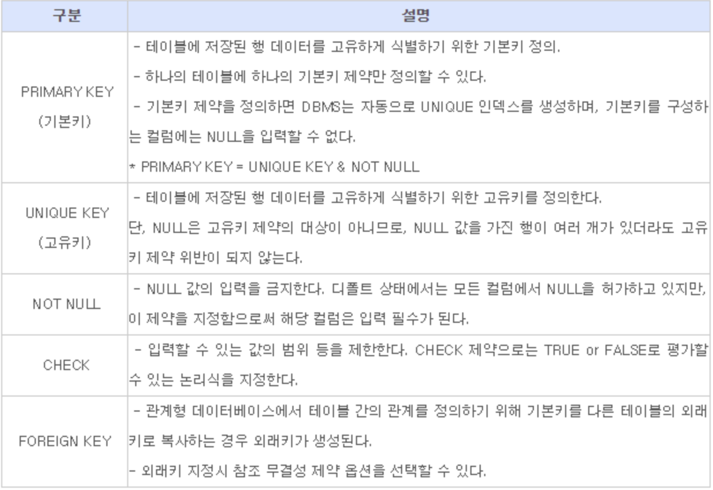

# Bit_FinalProject

# 개발환경 
Linux_Ubuntu

# DB [행(low)과 열(column)으로 구성된 2차원 데이터]

MySQL를 개선한 MariaDB 사용

0. Not NULL
1. Primary key (ex. 사번)
2. Unique (ex. 전화번호)
3. Foreign Key (DB에 저장되어있는 Data)

</img>

MariaDB(https://downloads.mariadb.org/)

</img>
</img>