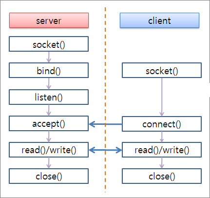
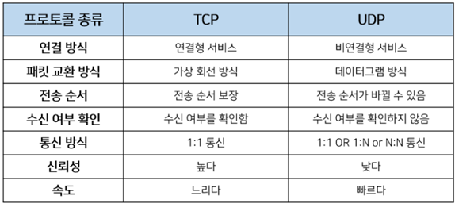
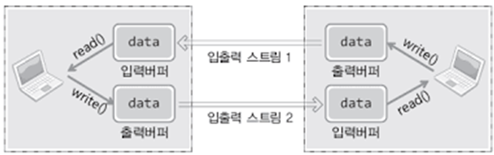

## TCP / IP <Linux_Ubuntu>
리눅스는 윈도우와 달리 소켓조작을 파일조작과 동일하게 간주한다.

</img>

---
## Socket 통신 

### 1. Server
<br>

1. 소켓생성 <socket 함수호출>
``` c
#include <sys/socket.h>

// domain : 소켓이 사용할 프로토콜 체계 정보 전달
// type : 소켓의 데이터 전송방식에 대한 정보 전달
// protocol : 두 컴퓨터간 통신에 사용되는 프로토콜 정보 전달
int socket(int domain, int type, int protocol);
```
2. IP주소와 PORT번호 할당 <bind 함수호출>
``` c
#include <sys/socket.h>

int bind(int sockfd, struct sockaddr *myaddr, socklen_t addrlen);
```
3. 연결요청 가능상태로 변경 <listen 함수호출>
``` c
#include <sys/socket.h>

int listen(int sockfd, int backlog);
```
4. 연결요청에 대한 수락 <accept> 함수호출>
``` c
#include <sys/socket.h>

int accept(int sockfd, struct sockaddr *addr, socklen_t *addrlen);
```

---

### 2. Client
<br>

1. 소켓연결 <connect 함수호출>
``` c
#include <sys/socket.h>

int connect(int sockfd, struct sockaddr *serv_addr, socklen_t addrlen);
```
---

## 파일 관리
<br>

|파일 디스크립터|대 상|
|:--------------:|---|
|0|표준입력 : Standard Input|
|1|표준출력 : Standard Output|
|2|표준에러 : Standard Error|

<br>

1. 파일 열기
``` c
#include <sys/types.h>
#include <sys/stat.h>
#include <fcntl.h>

// path : 파일 이름을 나타내는 문자열의 주솟값
// flag : 파일 오픈 모드 정보 전달
int open(const char *path, int flag);
```
2. 파일 닫기
``` c
#include <unistd.h>

// fd : 닫고자 하는 파일 또눈 소켓의 파일 디스크립터 전달
int close(int fd);
```
3. 데이터 쓰기
``` c
#include <unistd.h>

// fd : 데이터 전송대상을 나타내는 파일디스크립터 전달
// buf : 전송할 데이터가 저장된 버퍼의 주소 값 전달
// nbytes : 전송할 데이터의 바이트 수 전달
size_t write( int fd, const void *buf, size_t nbytes);
```

|오픈 모드|의 미|
|------|---|
|O_CREAT|필요하면 파일을 생성|
|O_TRUNC|기존 데이터 전부 삭제|
|O_APPEND|기본 데이터 보존하고, 뒤에 이어서 저장|
|O_RDONLY|읽기 전용으로 파일 오픈|
|O_WRONLY|쓰기 전용으로 파일 오픈|
|O_RDWR|읽기, 쓰기 겸용으로 파일 오픈|
<br>

4. 파일에 저장된 데이터 읽기
``` c
#include <unistd.h>

// fd : 데이터 수신대상을 나타내는 파일디스크립터 전달
// buf : 수신한 데이터가 저장할 버퍼의 주소 값 전달
// nbytes : 수신할 최대 바이트 수 전달
ssize_t read( int fd, const void *buf, size_t nbytes);
```

## 프로토콜(Protocol) : 소켓함수 1번째 인자
컴퓨터 상호간의 대화에 필요한 통신규약

</img>
<br>
<br>

### 1. 프로토콜 체계(Protocol Family)
[헤더파일 sys/socket.h에 선언되어 있는 프로토콜 체계]
|이름|프로토콜 체계(Protocol Family)|
|------|---|
|PF_INET|IPv4 인터넷 프로토콜 체계|
|PF_INET6|IPv6 인터넷 프로토콜 체계|
|PF_LOCAL|로컬 통신을 위한 UNIX 프로토콜 체계|
|PF_PACKET|Low Level 소켓을 위한 프로토콜 체계|
|PF_IPX|IPX 노벨 프로토콜 체계|
<br>
<br>

## 소켓타입(Type) : 소켓함수 2번째 인자

### 1. 연결지향형 소켓(SOCK_STREAM) vs 비 연결지향형 소켓(SOCK_DGRAM)
* 연결지향형 소켓(SOCK_STREAM) : 1대 1 컨베이너 벨트
  1. 중간에 데이터가 소멸되지 않고 목적지로 전송된다.
  2. 전송 순서대로 데이터가 수신된다.
  3. 전송 데이터의 경계(Boundary)가 존재하지 않는다.
* 비 연결지향형 소켓(SOCK_DGRAM) : 택배
  1. 전송 데이터의 손실, 파손의 우려가 있다.
  2. 전송되는 데이터의 경계(Boundary)가 존재한다.
  3. 한번에 전송할 수 있는 데이터의 크기가 존재한다.

## 소켓함수 3번째 인자

### 1. 소켓함수의 3번째 인자는 다음과 같은 상황이 발생할 때 필요하다.
* 하나의 프로토콜 체계 안에 데이터의 전송방식이 동일한 프로토콜이 둘 이상 존재할 경우

ex1 ) IPv4 인터넷 프로토콜 체계에서 동작하는 연결지향형 테이터 전송 소켓 
``` c
int tcp_socket = socket(PF_INET, SOCK_STREAM, IPPROTO_TCP);
```
ex2 ) IPv4 인터넷 프로토콜 체계에서 동작하는 비 연결지향형 테이터 전송 소켓
``` c
int tcp_socket = socket(PF_INET, SOCK_DGRAM, IPPROTO_UDP);
```

## 소켓에 항당되는 IP주소와 PORT번호

### 1. 인터넷 주소(Internet Address)
* IPv4(Internet Protocol version 4) : 4Byte 주소체계
* IPv6(Internet Protocol version 6) : 16Byte 주소체계

### 2. 클래스 별 네트워크 주소와 호스트 주소의 경계
* 클래스 A의 첫 번쨰 바이트 범위 0 ~ 127
* 클래스 B의 첫 번쨰 바이트 범위 128 ~ 191
* 클래스 C의 첫 번쨰 바이트 범위 192 ~ 223
---
이는 다음과 같이 달리 표현될 수 있다.
* 클래스 A의 첫 번쨰 비트는 항상 0으로 시작
* 클래스 B의 첫 번쨰 비트는 항상 10으로 시작
* 클래스 C의 첫 번쨰 비트는 항상 110으로 시작

### 3. 소켓의 구분에 활용되는 PORT번호
IP를 통해 서버를 찾았다면 PORT를 이용하여 서버에서 내가 필요로 하는 프로그램을 찾는다.
<br>
그러므로 PORT번호는 하나의 소켓에만 할당이 가능하다 (2이상 소켓에 할당할 수 없다.
<br>
포트번호는 16비트로 표현되며 0 ~ 65535이하개가 존재하며 이중 0 ~ 1023번 까진 특정 프로그램에 할당되어 있다.
<br>
! TCP소켓과 UDP소켓은 PORT를 공유하지 않기 때문에 중복이 가능하다!

## 네트워크 바이트 순서

### 1. 빅 엔디안(Big Endian) vs 리틀 엔디안(Little Endian)
* 빅 엔디안(Big Endian) : 상위 바이트의 값을 작은 번지수에 저장
* 리틀 엔디안(Little Endian) : 상위 바이트의 값을 큰 번지수에 저장

네트워크상 테이터를 전송할 땐 빅 엔디안을 사용하기로 약속

## Half-Close

### 1. 스트림(Stream) : 소켓을 통해 두 호스트가 연결된 상태

</img>

Half-Close 는 2개의 입출력 스티림중 1개의 스트림을 끊어버리는 것을 의미한다. 
``` c
#include <sys/socket.h>

// sock : 종료할 소켓의 파일 디스크립터 전달
// howto : 종료방법에 대한 정보 전달
int shutdown(int sock, int howto);
```
이중 howto에 전달될 수 있는 매개변수는 다음과 같다.
1. SHUT_RD : 입력 스트림 종료
2. SHUT_WR : 출력 스트림 종료
3. SHUT_RDWR : 입출력 스트림 종료

## TCP flag(URG, ACK, PSH, RST, SYN, FIN)

TCP(Transmission Control Protocol)는 3-WAY Handshake 방식을 통해 두 지점 간에 세션을 연결하여 통신을 시작 하고 4-WAY Handshake를 통해 세션을 종료하여 통신을 종료 한다.

이러한 세션연결과 해제 이외에도 데이터를 전송하거나 거부, 세션 종료 같은 기능이 패킷의 FLAG 값에 따라 달라지게 되는데, TCP FLAG는 기본적으로 6 가지로 구성된다.


FLAG 순서

+-----+-----+-----+----+-----+----+

| URG  | ACK | PSH | RST | SYN | FIN |

+-----+-----+-----+----+-----+----+

각각 1비트로 TCP 세그먼트 필드 안에 cONTROL BIT 또는 FLAG BIT 로 정의 되어 있다.


+ SYN(Synchronization:동기화) - S : 연결 요청 플래그

  + TCP 에서 세션을 성립할 때  가장먼저 보내는 패킷, 시퀀스 번호를 임의적으로 설정하여 세션을 연결하는 데에 사용되며 초기에 시퀀스 번호를 보내게 된다.

* ACK(Acknowledgement) - Ack : 응답

  * 상대방으로부터 패킷을 받았다는 걸 알려주는 패킷, 다른 플래그와 같이 출력되는 경우도 있다.

+ RST(Reset) - R : 제 연결 종료
  + 재설정(Reset)을 하는 과정이며 양방향에서 동시에 일어나는 중단 작업이다. 비 정상적인 세션 연결 끊기에 해당한다.

+ PSH(Push) - P : 밀어넣기

  + TELNET 과 같은 상호작용이 중요한 프로토콜의 경우 빠른 응답이 중요한데, 이 때 받은 데이터를 즉시 목적지인 OSI 7 Layer 의 Application 계층으로 전송하도록 하는 FLAG. 대화형 트랙픽에 사용되는 것으로 버퍼가 채워지기를 기다리지 않고 데이터를 전달한다. 데이터는 버퍼링 없이 바로 위 계층이 아닌 7 계층의 응용프로그램으로 바로 전달한다.

+ URG(Urgent) - U : 긴급 데이터
  + Urgent pointer 유효한 것인지를 나타낸다. Urgent pointer란 전송하는 데이터 중에서 긴급히 전당해야 할 내용이 있을 경우에 사용한다.
      
    EX) ping 명령어 실행 도중 Ctrl+c 입력

+ FIN(Finish) - F : 연결 종료 요청
  + 세션 연결을 종료시킬 때 사용되며 더이상 전송할 데이터가 없음을 나타낸다.

## 프로세스(Process)의 이해
메모리 공간을 차지한 상태에서 실행중인 프로그램

### 1. 멀티프로세스 vs 멀티플렉싱 vs 멀티쓰레딩

1. 멀티프로세스 기반 서버 : 다수의 프로세스를 생성하는 방식으로 서비스 제공
2. 멀티플렉싱 기반 서버 : 입출력 대상을 묶어서 관리하는 방식으로 서비스 제공
3. 멀티쓰레딩 기반 서버 : 클라이언트의 수만큼 쓰레드를 생성하는 방식으로 서비스 제공

### 2. fork 함수호출을 통한 프로세스의 생성

``` c
#include <unistd.h>

pid_t fork(void);
```
+ 부모 프로세스 : fork 함수의 반환 값은 자식 프로세스의 ID
+ 자식 프로세스 : fork 함수의 반환 값은 0

### 3. 좀비 프로세스
해당 자식 프로세스를 생성한 부모 프로세스에게 exit 함수의 인자 값이나 return문의 반환 값이 전달 되어야 한다.

## 쓰레드(Thread)

### 1. 프로세스 vs 스레드
+ 프로세스 : 운영체제 관점에서 별도의 실행흐름을 구성하는 단위
+ 쓰레드 : 프로세스 관점에서 별도의 실행흐름을 구성하는 단위

### 2. 쓰레드 생성 및 실행
```c
#include <pthread.h>

int pthread_create (pthread_t *restrict thread, const pthread_attr_t *restrict attr, void *(*start_routine)(void*), void *restrict arg);
````
+ tread : 생성할 쓰레드의 ID 저장을 위한 변수의 주소 값 전달, 참고로 쓰레드는 프로새스와 마찬가지로 쓰레드의 구분을 위한 ID가 부여된다.
+ attr : 쓰레드에 부여할 특성 정보의 전달을 위한 매개변수, NULL 전달 시 기본적인 특성의 쓰레드가 생성된다.
+ start_routine : 쓰레드의 main 함수 역할을 하는, 별도 실행흐름의 시작이 되는 함수의 주소 값(함수 포인터) 전달.
+ arg : 세 번째 인자를 통해 등록된 함수가 호출될 떄 전달할 인자의 정보를 담고 있는 변수의 주소 값 전달.

## 포트포워딩(Port forwarding)
외부에서 공인IP를 통해 시설IP에 접속하기 위한 작업

## 뮤텍스(Mutex)
뮤텍스는 화장실이 하나 뿐이 없는 식당과 비슷하다. 화장실을 가기 위해서는 카운터에서 열쇠를 받아 가야 한다.

화장실을 가려고 하는데 카운터에 키가 있으면 화장실에 사람이 없다는 뜻이고 그 열쇠를 이용해 화장실에 들어갈 수 있다.

## Port Kill
port 확인 명령어
```cmd
netstat -ntlp | grep : 포트번호
```
port kill
```cmd
fuser -k 20001/tcp
```

## Time wait 방지
```c
pthread_t t_id;
soclen_t optlen;
int option;

serv_sock=socket(PF_INET, SOCK_STREAM, 0);	

// time wait
optlen = sizeof(option);
option = 1;
setsockopt(serv_sock, SOL_SOCKET, SO_REUSEADDR, (void*)&option, optlen);
```